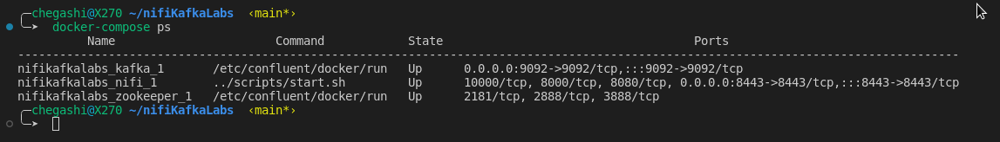

# docker-nifi
A simple setup for running NiFi using docker images.

# Prerequisites

Docker

# Docker image
```
git clone https://github.com/Chegashi/nifiKafkaLabs.git
```

# Set up
```
cd nifiKafkaLabs
```

```
docker-compose up
```

```
docker-compose ps
```
get the name of nifi container in my case the name is :  ***nifikafkalabs_nifi_1***
line 2 column 1


```
docker exec -it [nifi_container_name] /bin/sh
```

open "https://localhost:8443/nifi"
```

```
docker exec nifikafkasmm_kafka_1 kafka-topics --bootstrap-server nifikafkasmm_kafka_1:9092 --create --topic quickstart
```

# Useful Docker Aliases that Make Docker Less Complex
```
alias dockerstp='docker stop $(docker ps -aq)'
alias dockermc='docker rm -f $(docker ps -aq)'
alias dockermi='docker rmi -f $(docker images -aq)'
alias dockermvlm='docker volume rm $(docker volume ls -q)'
alias dockermnet='docker network rm  $(docker network ls -q)'
alias dockercl='dockerstp ; dockermc ; dockermi ; dockermvlm ; dockermnet'
```
